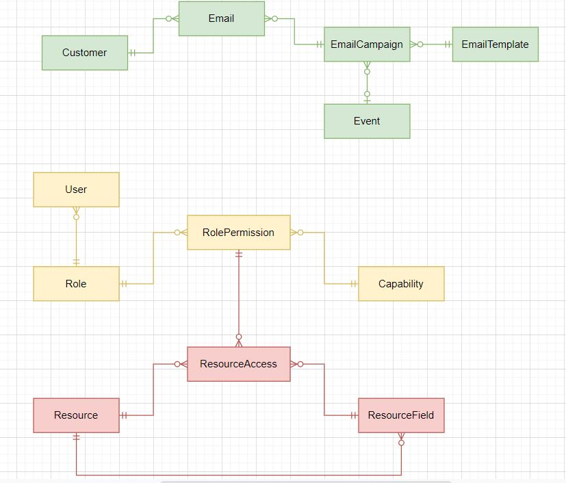
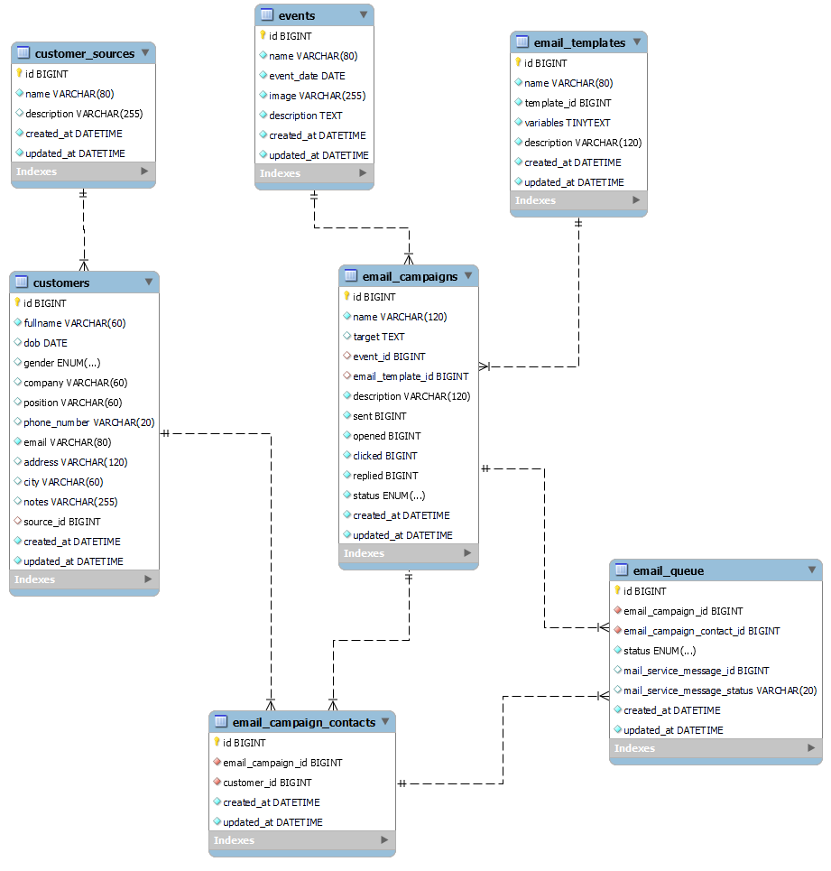

# TypeORM Practice

## Prerequisites

1. Connection

### Installing CLI

```bash
yarn add ts-node typeorm
```

```json
"scripts": {
  "typeorm": "node --require ts-node/register ./node_modules/typeorm/cli.js",
  "test": "echo \"Error: no test specified\" && exit 1"
},
```

## Excercise 1



### Diagrams



```bash
yarn typeorm init --express --docker
```

## References

- [TypeORM Official](https://typeorm.io/#/using-cli)
- [TypeORM CheatSheet](https://gist.github.com/misostack/cc1cc7a16a607fdcf84b61daf20d38d5)
